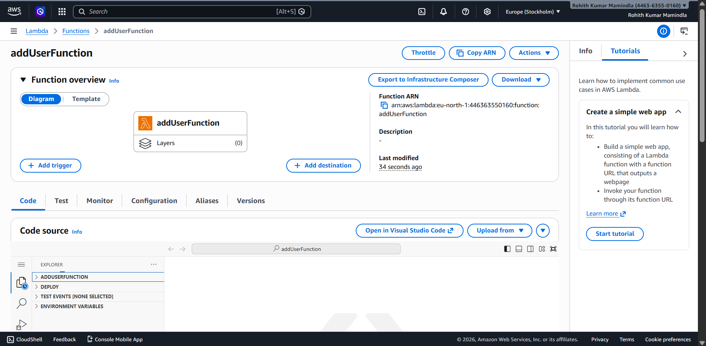
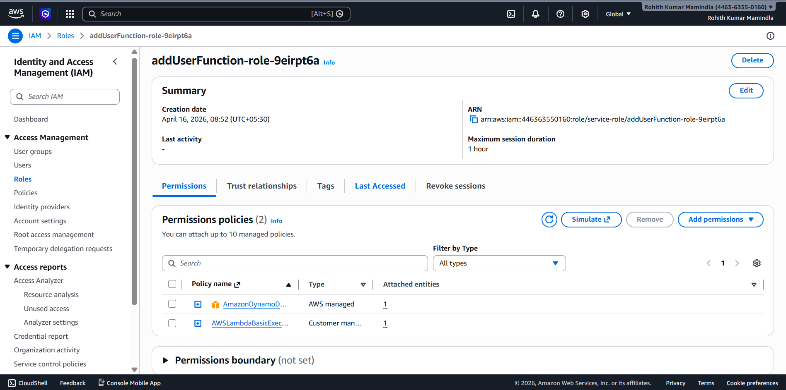
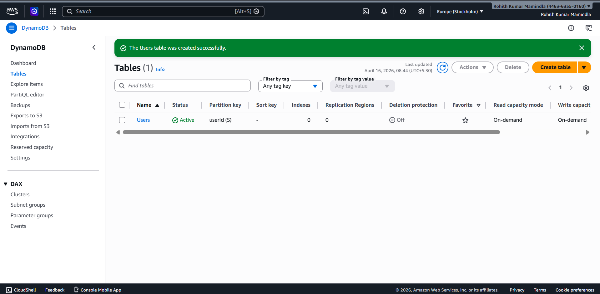
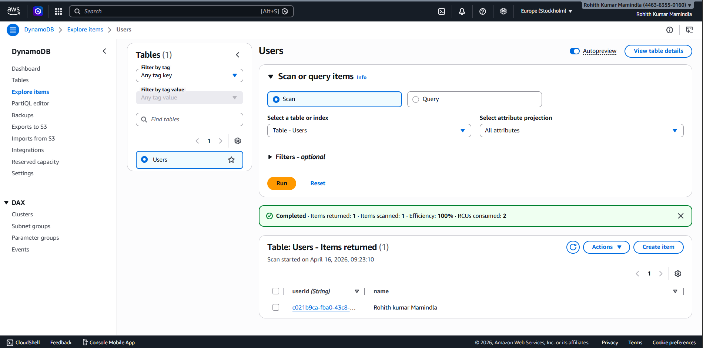
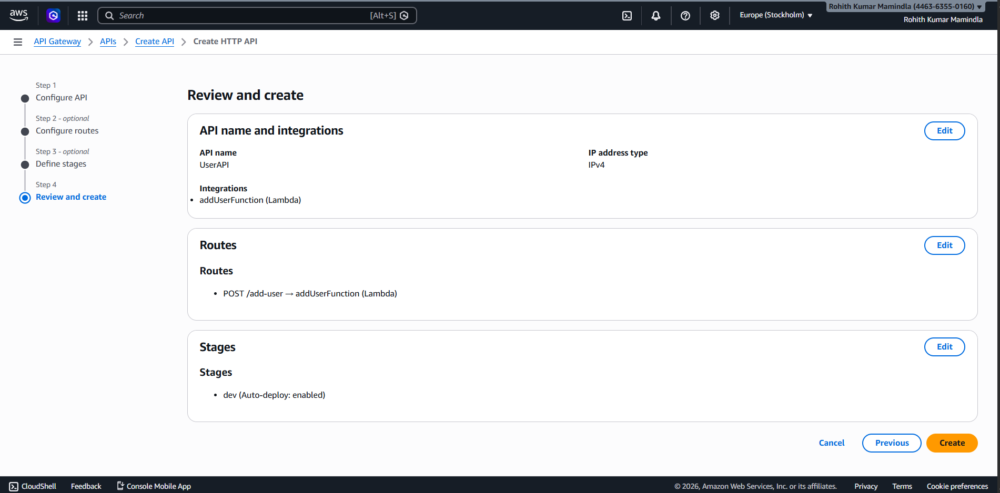
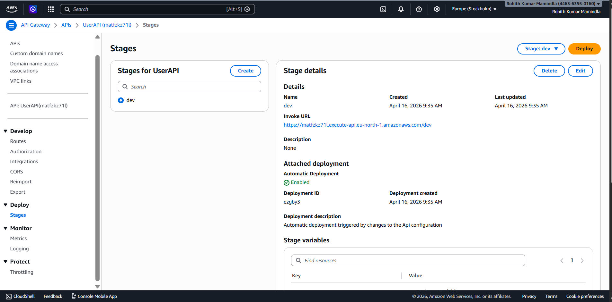
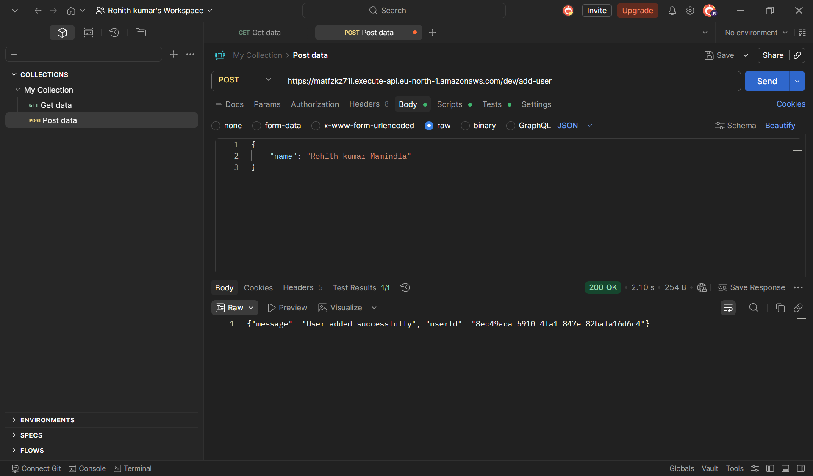
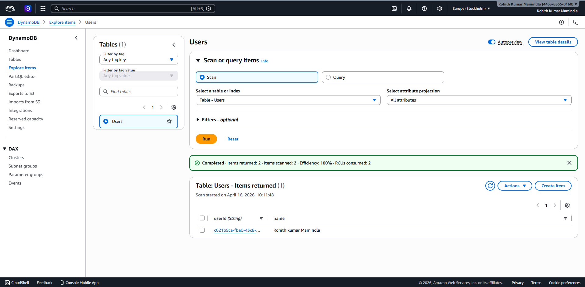

AWS Serverless User API (Lambda + API Gateway + DynamoDB)

Project Overview

This project demonstrates a complete serverless backend system built on AWS.
It allows users to send data via an API, processes it using Lambda, and stores it in DynamoDB.

The goal was to understand real-world serverless architecture and API-driven backend systems.

Architecture
Amazon API Gateway → Handles HTTP requests
AWS Lambda → Processes logic
Amazon DynamoDB → Stores user data

What I Built
Created a DynamoDB table (Users) with userId as partition key
Developed a Lambda function (addUserFunction)
Connected Lambda with DynamoDB using IAM permissions
Built an HTTP API using API Gateway
Created a POST /add-user route
Tested API using Postman
Verified data storage in DynamoDB

Screenshots & Explanation
1. Lambda Function Created

- Shows the Lambda function setup
-Confirms backend logic is deployed

2. Lambda Permissions

- Shows IAM role attached to Lambda
-Ensures Lambda can write logs and access AWS services

3. DynamoDB Table Created

-Shows Users table structure
-Defines schema for storing user data

4. DynamoDB Data (Initial Scan)

-Shows scanned items in table
- Confirms database is active and accessible

5. API Gateway Setup

-Shows API configuration
- Defines routes and integration with Lambda

6. API URL

-Shows generated invoke URL
-Used to access backend externally

7. API Success Response

-Shows Postman response
-Confirms API → Lambda → DynamoDB flow works

8. Final DynamoDB Data

-Shows final stored record
-Confirms full system integration success

Key Learnings
How serverless architecture works in AWS
API Gateway routing and HTTP methods
Lambda function execution flow
IAM roles and permissions in AWS
DynamoDB as a NoSQL database
End-to-end API debugging

Challenge Faced
Issue:

API returned "Not Found" error initially

Root Cause:

Incorrect API route and misunderstanding of /dev stage usage

Fix:

Corrected endpoint to:

/dev/add-user

Cost Awareness
Used only AWS Free Tier services
No provisioned servers (fully serverless)
No ongoing cost when idle

Future Improvements
Add input validation in Lambda
Add GET API to fetch users
Add authentication using Cognito
Deploy frontend UI for API

Summary

This project demonstrates a complete serverless backend pipeline from API request → processing → database storage.